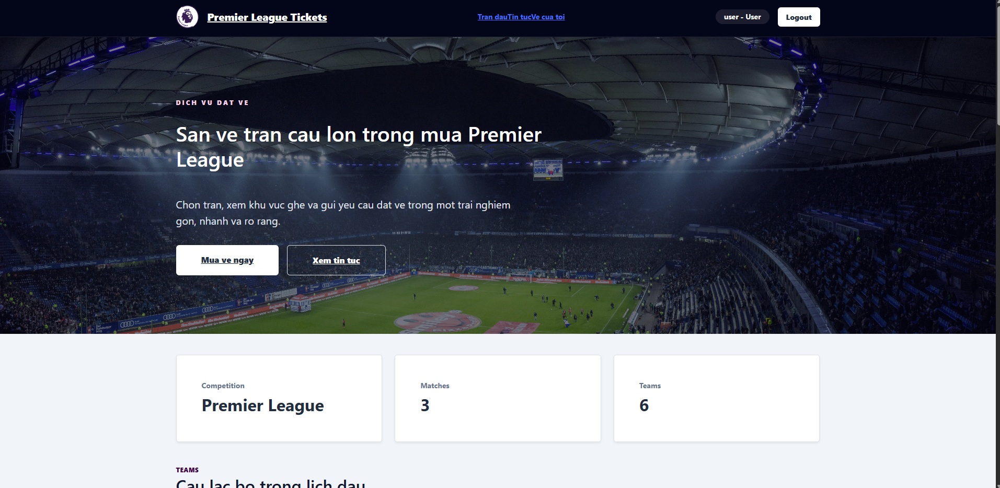
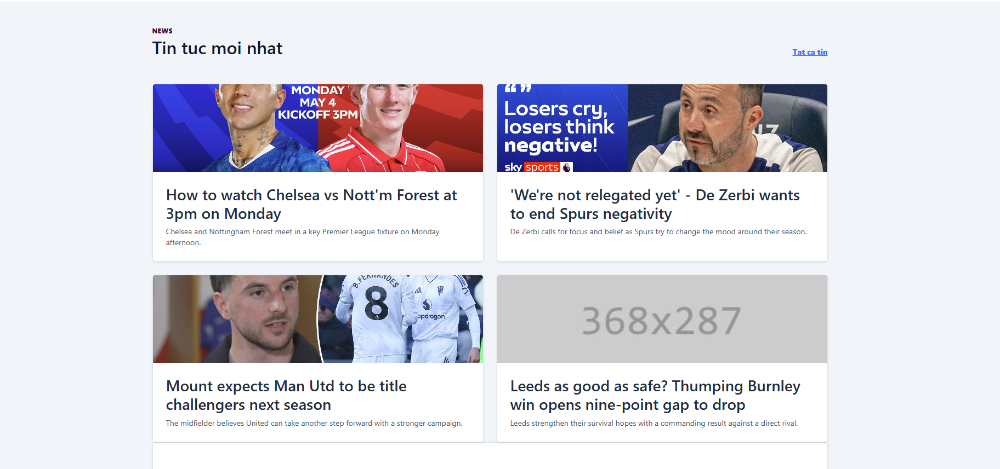
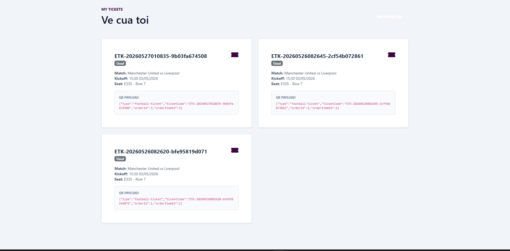
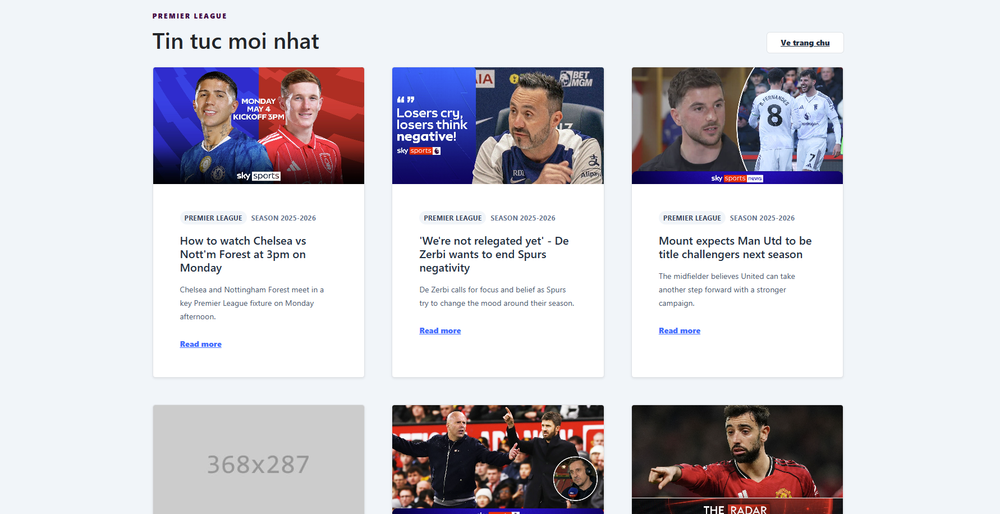
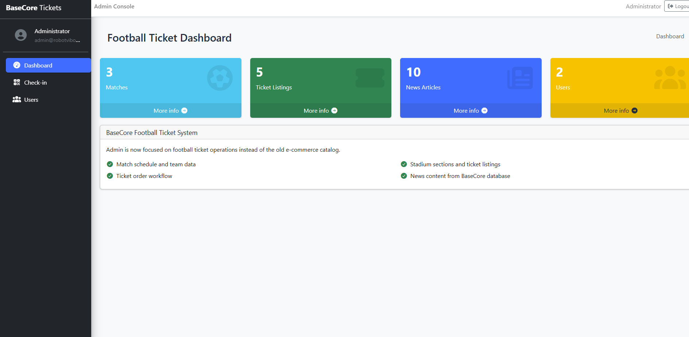

# Demo Guide - Football Ticket Booking System

Ngày tạo: 2026-05-27

## 1. Mục tiêu demo

Tài liệu này dùng để demo và viết báo cáo cho hệ thống đặt vé bóng đá. Hệ thống đã có luồng chính từ đăng nhập, xem trận đấu, đặt vé, thanh toán, sinh e-ticket/QR, check-in QR và quản lý admin.

Địa chỉ chạy demo:

| Thành phần | URL |
| --- | --- |
| Frontend | `http://localhost:3000/login` |
| API Gateway | `http://localhost:5000` |
| APIService | `http://localhost:5001` |
| AuthService | `http://localhost:5002` |

Tài khoản demo:

| Vai trò | Username | Password |
| --- | --- | --- |
| User | `user` | `user123` |
| Admin | `admin` | `admin123` |

## 2. Luồng demo chính

### 2.1. Luồng người dùng đặt vé

1. Mở frontend tại `http://localhost:3000/login`.
2. Đăng nhập bằng tài khoản `user/user123`.
3. Vào trang chủ, hệ thống gọi `GET /api/matches` để hiển thị danh sách trận đấu thật từ database.
4. Chọn một trận đấu, ví dụ `man-utd-liverpool`.
5. Trang đặt vé gọi `GET /api/matches/{slug}/tickets` để lấy khu vực ghế, hàng ghế, giá vé và số lượng còn lại.
6. Chọn vé và tạo đơn bằng `POST /api/tickets/orders`.
7. Hệ thống chuyển sang trang `/payments/{orderId}`.
8. Tạo payment bằng `POST /api/payments`.
9. Xác nhận thanh toán bằng `POST /api/payments/{id}/confirm`.
10. Sau khi thanh toán thành công, backend sinh e-ticket và QR payload.
11. Vào trang `/my-tickets` để xem vé điện tử bằng `GET /api/tickets/etickets`.

### 2.2. Luồng admin/staff check-in

1. Đăng xuất tài khoản user.
2. Đăng nhập bằng tài khoản `admin/admin123`.
3. Vào trang `/admin/checkin`.
4. Copy `ticketCode` hoặc `qrCodePayload` từ trang Vé của tôi.
5. Gửi check-in bằng `POST /api/checkins`.
6. Lần check-in đầu tiên trả về thành công.
7. Check-in lại cùng một vé trả về `409 Conflict`, giao diện cần hiển thị thông báo vé đã được sử dụng.

## 3. Ảnh màn hình demo

### Trang chủ người dùng



Trang chủ hiển thị hero Premier League, thông tin tổng quan và điều hướng tới trang đặt vé, tin tức, vé của tôi.

### Khu vực tin tức trên trang chủ



Trang chủ có khu vực tin tức, hiển thị các bài viết lấy từ database thông qua API news.

### Trang vé của tôi



Trang vé của tôi hiển thị các e-ticket đã sinh sau thanh toán, gồm `ticketCode`, trạng thái, thông tin trận, ghế và QR payload.

### Trang tin tức



Trang tin tức hiển thị danh sách bài viết theo layout card. Phần này phục vụ nội dung phụ, chưa phải trọng tâm nghiệp vụ đặt vé.

### Admin dashboard



Admin dashboard hiển thị thống kê tổng quan về trận đấu, ticket listing, tin tức và user. Sidebar có mục Dashboard, Check-in và Users.

## 4. Phân tích hệ thống

### 4.1. Kiến trúc tổng quan

Hệ thống được tách thành các lớp/chức năng chính:

| Thành phần | Vai trò |
| --- | --- |
| `BaseCore.WebClient` | Frontend React/Vite cho người dùng và admin |
| `BaseCore.ApiGateway` | Gateway dùng Ocelot, gom các API về một cổng `http://localhost:5000` |
| `BaseCore.APIService` | API nghiệp vụ về trận đấu, vé, đơn hàng, thanh toán, check-in, admin |
| `BaseCore.AuthService` | API xác thực, đăng nhập và phát JWT |
| `BaseCore.Repository` | EF Core DbContext, migrations và truy cập SQL Server |
| `BaseCore.Entities` | Entity/domain model dùng chung |

Frontend không gọi trực tiếp từng service riêng lẻ mà dùng gateway:

```text
Frontend -> http://localhost:5000/api -> Ocelot Gateway -> APIService/AuthService -> SQL Server
```

Cách này giúp frontend chỉ cần một `baseURL`, đồng thời dễ quản lý routing, auth token và mở rộng service về sau.

### 4.2. Database

Database dùng SQL Server với EF Core migration. DbContext chính là `SqlServerDbContext`, gồm các bảng nghiệp vụ:

| Nhóm | Bảng/entity |
| --- | --- |
| Tài khoản và phân quyền | `Users`, `Roles`, `UserRoles`, module/function liên quan |
| Bóng đá | `Teams`, `Seasons`, `MatchRounds`, `Stadiums`, `StadiumSections`, `FootballMatch` |
| Bán vé | `TicketListings`, `TicketOrders`, `TicketOrderItems` |
| Thanh toán | `Payments` |
| Vé điện tử và check-in | `ETickets`, `TicketCheckins` |
| Nội dung | `NewsArticles` |

Quan hệ chính:

- Một `Season` có nhiều `MatchRound`.
- Một `MatchRound` thuộc một `Season` và có tối đa 10 trận.
- Một `FootballMatch` gắn với sân vận động và hai đội bóng.
- Một `FootballMatch` thuộc một `Season` và một `MatchRound`.
- Một `FootballMatch` có nhiều `TicketListing`.
- Một `TicketOrder` thuộc về một user và có nhiều `TicketOrderItem`.
- Một `Payment` thuộc về một `TicketOrder`.
- Sau khi payment được confirm, backend sinh `ETicket`.
- `TicketCheckin` ghi lại lịch sử check-in của từng `ETicket`.

Điểm hợp lý của database hiện tại là đã tách rõ ticket listing, order item, payment và e-ticket. Nhờ vậy hệ thống có thể mở rộng các trạng thái như pending, paid, cancelled, issued, used mà không làm rối logic đặt vé.

Phần lịch thi đấu đã bổ sung mô hình mùa giải/vòng đấu:

- Seed sẵn mùa `2026-2027`.
- Seed sẵn `Vòng 1`.
- Các trận cũ được gán vào mùa `2026-2027` và `Vòng 1`.
- Backend validate `HomeTeamId != AwayTeamId`.
- Trong cùng một vòng, mỗi đội chỉ được xuất hiện một lần.
- Mỗi vòng tối đa 10 trận, phù hợp Premier League 20 đội.

### 4.3. Backend API

Gateway đang expose các nhóm endpoint chính:

| Nhóm API | Endpoint tiêu biểu | Vai trò |
| --- | --- | --- |
| Auth | `POST /api/auth/login` | Đăng nhập và lấy JWT |
| Matches | `GET /api/matches`, `GET /api/matches/{slug}/tickets` | Xem trận đấu và vé |
| Match rounds | `GET /api/matches/rounds?season=2026-2027` | Xem danh sách vòng đấu theo mùa |
| Tickets | `POST /api/tickets/orders`, `GET /api/tickets/etickets` | Tạo đơn và xem e-ticket |
| Payments | `POST /api/payments`, `POST /api/payments/{id}/confirm` | Tạo và xác nhận thanh toán |
| Check-in | `POST /api/checkins` | Admin check-in QR/mã vé |
| Admin | `GET /api/admin/matches`, `GET /api/admin/orders` | Quản lý dữ liệu nghiệp vụ |
| News | `GET /api/news` | Lấy tin tức |

Luồng backend đã được test thành công:

- Đăng nhập user/admin.
- Lấy danh sách trận.
- Lọc trận theo mùa/vòng bằng `GET /api/matches?season=2026-2027&round=1`.
- Lấy danh sách vòng bằng `GET /api/matches/rounds?season=2026-2027`.
- Lấy ticket listing theo slug.
- Tạo order.
- Tạo payment.
- Confirm payment.
- Sinh e-ticket.
- Check-in thành công.
- Check-in trùng trả về `409 Conflict`.
- Validate admin tạo trận: đội nhà trùng đội khách trả `400`, đội đã đá trong cùng vòng trả `409`, vòng đủ 10 trận trả `409`.

Backend hiện là phần hoàn thiện nhất của project: có transaction khi confirm payment, có kiểm tra quyền theo JWT, có tách controller theo nghiệp vụ và có tài liệu test riêng trong `docs/backend-api-test-result.md`.

### 4.4. Giao diện frontend

Frontend hiện đã kết nối API thật qua file `BaseCore.WebClient/src/services/api.js`:

```text
API_BASE_URL = http://localhost:5000/api
```

Các trang đã có:

| Trang | Vai trò |
| --- | --- |
| `/login` | Đăng nhập thật bằng API |
| `/` hoặc home | Hiển thị trận đấu và nội dung trang chủ |
| Booking page | Lấy vé theo trận và tạo order |
| `/payments/:orderId` | Tạo và confirm payment |
| `/my-tickets` | Hiển thị e-ticket/QR payload |
| `/admin/checkin` | Admin check-in mã vé/QR |
| Admin dashboard | Hiển thị thống kê cơ bản |

Nhận xét thẳng về frontend hiện tại:

- Giao diện đã chạy được luồng chính, nhưng còn sơ khai và thiếu cảm giác sản phẩm hoàn chỉnh.
- Trang booking chưa có seat map trực quan, chưa có chọn ghế theo sơ đồ sân.
- QR mới hiển thị payload text, chưa render thành QR code thật để quét.
- Payment đang là confirm thủ công, chưa mô phỏng cổng thanh toán rõ ràng.
- Admin mới có dashboard và check-in cơ bản, chưa có màn hình CRUD đầy đủ/đẹp cho match, section, ticket và order.
- Loading/error state đã có ở mức cơ bản nhưng chưa đồng nhất toàn bộ UI.
- Role-based navigation còn đơn giản, cần chặn route rõ hơn cho user/admin.
- Tin tức và trang chủ còn mang tính trình bày, chưa đồng bộ hoàn toàn với logic đặt vé.

Kết luận: frontend hiện dùng được để demo flow API, nhưng nếu chấm theo sản phẩm hoàn chỉnh thì cần tiếp tục nâng cấp UX và logic UI.

### 4.5. Kiểm thử

Đã có hai tài liệu test:

- `docs/backend-api-test-result.md`
- `docs/frontend-e2e-test-result.md`

Kết quả chính:

| Hạng mục | Kết quả |
| --- | --- |
| Backend build | Thành công, 0 warning, 0 error |
| Vulnerability audit | Không còn package vulnerable theo NuGet audit |
| API E2E | Đặt vé, payment, e-ticket, check-in OK |
| Season/Round API | `GET /api/matches`, filter season/round, `GET /api/matches/rounds` OK |
| Match round validation | home == away `400`, đội trùng vòng `409`, vòng đủ 10 trận `409` |
| Duplicate check-in | Trả về `409` đúng mong đợi |
| Frontend build | `npm run build` thành công |
| Frontend route smoke | `/login`, `/payments/1`, `/my-tickets`, `/admin/checkin` trả về `200 OK` |

Hạn chế của kiểm thử:

- Chưa có Playwright/Puppeteer/Selenium nên chưa automation click trên trình duyệt thật.
- Chưa có unit test cho controller/service.
- Chưa có test đồng thời đặt vé cùng một listing để bắt lỗi race condition/oversell.
- Chưa có test phân quyền chi tiết cho mỗi role.

## 5. Đánh giá mức độ hoàn thành

| Hạng mục | Trạng thái |
| --- | --- |
| Database ticket booking | Hoàn thành mức demo |
| Database Season/MatchRound | Hoàn thành mức demo |
| Backend API đặt vé | Hoàn thành |
| Backend API lịch theo mùa/vòng | Hoàn thành |
| Payment và sinh e-ticket | Hoàn thành mức demo |
| QR/check-in | Hoàn thành mức demo |
| Admin API | Có CRUD/read chính |
| Frontend user flow | Chạy được nhưng còn sơ khai |
| Frontend admin | Có dashboard/check-in, còn thiếu quản lý đầy đủ |
| Tài liệu test | Đã có |
| Tài liệu demo/báo cáo | File này |

## 6. Hướng phát triển tiếp theo

Ưu tiên nâng cấp frontend theo thứ tự:

1. Làm lại trang booking có seat map/khu vực ghế trực quan.
2. Render QR code thật từ `qrCodePayload` thay vì hiển thị JSON text.
3. Hoàn thiện payment UI: trạng thái pending/paid/failed, thông tin đơn hàng, nút quay lại.
4. Làm admin CRUD thật cho match, stadium section, ticket listing và order.
5. Thêm route guard theo role user/admin.
6. Thêm Playwright E2E để test từ login đến check-in trên browser.
7. Chuẩn hóa UI loading/error/empty state.

## 7. Lệnh chạy nhanh

Build backend:

```bash
dotnet build BaseCore.sln --no-restore
```

Build frontend:

```bash
cd BaseCore.WebClient
npm run build
```

Chạy frontend dev:

```bash
cd BaseCore.WebClient
npm run dev
```

API gateway:

```bash
dotnet run --project BaseCore.ApiGateway/BaseCore.ApiGateway.csproj --urls http://localhost:5000
```

API service:

```bash
dotnet run --project BaseCore.APIService/BaseCore.APIService.csproj --urls http://localhost:5001
```
